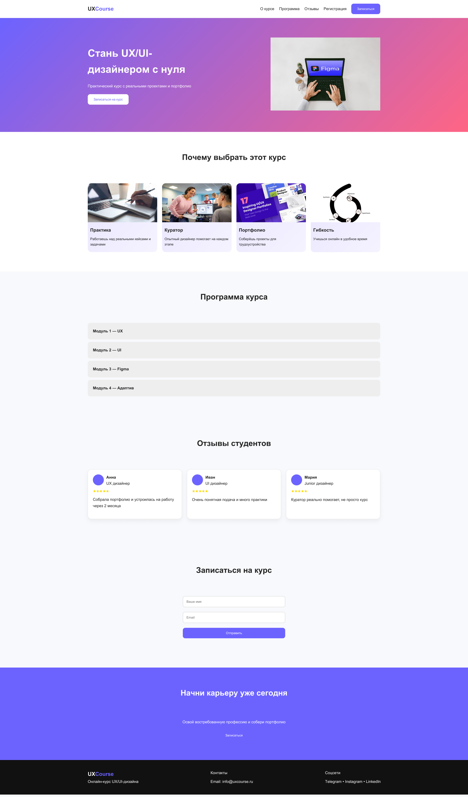

# Посадочная страница UX/UI курса

## Автор

Студент группы ТКМО-01-25 Урубков Александр

## Demo

https://lilrabid777.github.io/-/

## Preview

## О проекте

Проект представляет собой интерактивную посадочную страницу онлайн-курса «UX/UI-дизайн с нуля».

Основная задача — продемонстрировать, как с помощью фронтенд-технологий можно создать понятный и визуально привлекательный интерфейс, ориентированный на пользователя без опыта в дизайне.

Структура страницы выстроена таким образом, чтобы пользователь последовательно проходил путь от первого знакомства с продуктом до принятия решения о регистрации.

## UX-логика и решения

В основе проекта лежит гипотеза о том, что упрощённая структура и интерактивные элементы позволяют быстрее донести ценность курса и повысить конверсию.

Реализация включает:

* вынесение ключевого предложения и CTA в первый экран
* последовательное раскрытие информации (преимущества → программа → отзывы)
* использование аккордеона для снижения когнитивной нагрузки
* минимальное количество полей в форме регистрации

Интерактивные элементы (навигация, аккордеон, анимации) направлены на удержание внимания пользователя и улучшение восприятия контента.

## Интерфейс и визуальные решения

Визуальный стиль построен на ограниченной цветовой палитре и простой типографике, что соответствует принципам современного UX/UI-дизайна.

Используются:

* контрастные кнопки для акцента на действиях
* карточная структура для удобного восприятия информации
* hover-эффекты как средство обратной связи
* адаптивная сетка для корректного отображения на мобильных устройствах

## Интерактивность

JavaScript используется для реализации ключевых пользовательских сценариев:

* мобильная навигация через бургер-меню
* плавная прокрутка между разделами
* аккордеон программы курса
* валидация формы с мгновенной обратной связью

Это позволяет сделать интерфейс не только визуально понятным, но и функционально удобным.

## Результат

В результате был создан адаптивный лендинг, который:

* корректно отображается на различных устройствах
* содержит интерактивные элементы
* демонстрирует базовые принципы UX/UI-дизайна
* решает задачу презентации образовательного продукта

